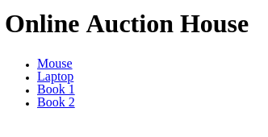
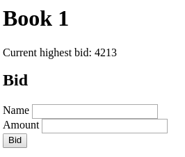
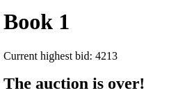
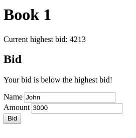

# Backend Auction exam

We are going to create a web-based auction application.

## Highlights

### It has two frontend pages which can:

- list all auction items
- save new bid to an auction item

### It has a backend which can:

- list all the auction items
- save new bid
- render page for bidding
- list all auction items in JSON format

## Database

There are two tables, one is `item` and another is `bid`.
In this application, `bid` can be assigned only to one `item`, but `item` can
have more `bid`s.

- item:
  - id, name, expire_date

- bid:
  - id, bidder_name, amount, item_id

Feel free to use the provided SQL file.
It is not mandatory, but can help you to have your database filled with data:

- [Database dump for MySQL](src/main/resources/backend-auction.sql)

## Endpoints

Create the following endpoints:

## GET `/`


- The main page should be rendered
- It must contain a list of all auction items (even the expired ones)
- Each auction item must be linked to the bidding page (GET `/item/{id}`)

## GET `/item/{id}` (get an auction item and give some info)

- The item's bidding page should be rendered with the specific auction item
- The current highest bid should be displayed
- When there is no bid for the auction item then the heighest bid value must be 0
- If the item's auction is over do not display the form to bid
- Else display a form with two input fields and a submit button
- The form should be submitted to POST `/item/{id}`
- Display a descriptive message if the auction item is not found

### The bidding page has 3 scenarios

#### 1. Default



----------------

#### 2. Over (the auction has ended)



----------------

#### 3. Message



## POST `/item/{id}` (insert bid)

- When the posted bid is less than or equal to the highest bid, then redirect to the
  GET `/item/{id}` endpoint using the message scenario with the message
  "Your bid is below the highest bid!"

- When the auction is over then redirect to GET `/item/{id}` endpoint using the over
  scenario

- In the case of error (posted data is not valid), then the form fields must contain the posted values

- When everything is valid it should insert the new bid and redirect to
  the GET `/item/{id}` endpoint using the default scenario.
   
   - The form values must be empty

- Display a descriptive error message in the case of error

## GET `/api/items`

- It should respond with the stored auction items in the following JSON format

- The `expiryDate`'s format might be different but must include the year, month,
  day, hour and minute
  
Example for JSON output format:

```json
[
  {
    "id": 3,
    "title": "Book 2",
    "expiryDate": "2018-03-04T23:12:123",
    "bids": [
      {
        "name": "John",
        "amount": 21344
      },
      {
        "name": "Jane",
        "amount": 321
      },
      {
        "name": "Doe",
        "amount": 73
      }
    ]
  },
  {
    "id": 4,
    "title": "Book 2",
    "expiryDate": "2018-03-04T23:12:123",
    "bids": [
      {
        "name": "Jake",
        "amount": 100
      },
      {
        "name": "Jackey",
        "amount": 232
      },
      {
        "name": "Dennis",
        "amount": 73
      }
    ]
  },
  ...
]
```

# SQL

Given the following table named `employees`

| id | name            | role         |
|:---|:----------------|:-------------|
| 1  | Bořivoj Souček  | mentor       |
| 2  | Kocsis Ivett    | psychologist |
| 3  | Papp Patrícia   | mentor       |
| 4  | Bence Jerk      | IT Support   |
| 5  | Dagmar Benešová | IT Support   |

And given the following table named `devices`

| id | name                  | serial_number | type   | employee_id |
|:---|:----------------------|:--------------|:-------|:------------|
| 1  | Bořivoj's iPhone      | 123-412-512   | mobile | 1           |
| 2  | Kocsis Ivett's device | 321-234-155   | laptop | 2           |
| 3  | Bořivoj's mobile      | 321-234-155   | mobile | 1           |
| 4  | Bence's mobile        | 810-344-999   | mobile | 4           |
| 5  | Bence's Macbook Pro   | 242-756-327   | laptop | 4           |

- Write an SQL query to select the name of those psychologists who have got at
least a mobile phone in an alphabetical order.
- Bence was terminated from our company so we need and our new colleague is Dagmar. Write a SQL update for passing Bence's devices to Dagmar. Device names are not needed to be updated.
- Write an SQL query which deletes Bence from the `employees` table
