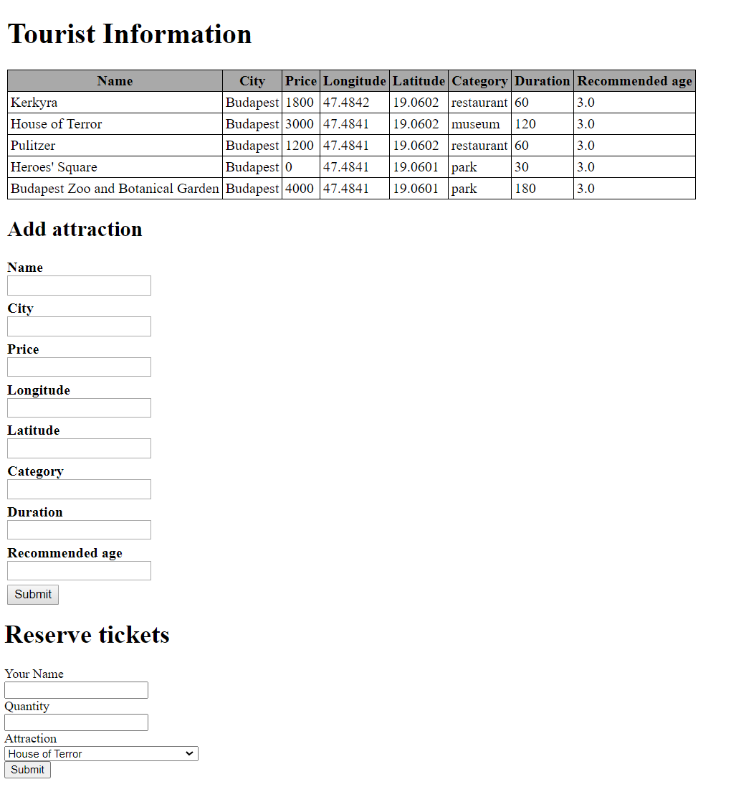

# Tourist Information

Build a web application for tourists to find the best attractions.

## Highlights

- It has a front-end that can:

  - List all attractions
  - Add/edit a new attraction via a form
  - Reserve tickets for an attraction

- It has a back-end which can:

  - Save new attractions
  - Find the cheapest attractions
  - Save new ticket reservations

## Database

The requirements are:

- All attractions and admissions need to be stored in the database
- Attractions and admissions will be stored in separate tables
- There must be some relationship between these tables

Feel free to use [the provided SQL file](assets/backend-attractions.sql).

## Endpoints

Create the following endpoints:

### GET `/`

The main page should look like this:



- All known attractions are listed in a table
- A form is displayed to add a new attraction and sending data to `POST /add` endpoint
- A form is displayed to reserve a ticket for an attraction and sending data to `POST /tickets/reserve`
- Users are not allowed to reserve tickets for restaurants (shouldn't have the option)

### POST `/add`

When a new attraction is saved:

- Validate the user input - every field is required!

  - Display an error message if the validation is failed

- Save the new attraction to the database (if all fields are provided and 
comply with the database constraints)

- Redirect to the main page

### GET `/edit/{id}`

The main page is rendered with the form prefilled with the attraction details:

- All known attractions are listed in a table
- A form is displayed to edit the attraction specified by its `id`
- A form is displayed to reserve a ticket for an attraction

### POST `/tickets/reserve`

When a new ticket reservation is saved:

- Validate the quantity - it should not be negative!

  - Display an error if the data is invalid

- Validate that the attraction is not a restaurant - they don't need tickets!

  - Display an error if the data is invalid

- Save the new ticket reservation (if the data is valid)

- Redirect to main page

### GET `/api/popular`

The most popular attraction (meaning the one with the 
highest quantities of reserved tickets) is returned in **JSON** format:

```json
{
    "id": 4,
    "name": "Heroes' Square",
    "city": "Budapest",
    "price": 0,
    "longitude": 47.4841,
    "latitude": 19.0601,
    "category": "park",
    "duration": 30,
    "recommendedAge": 3
}
```

### GET `/api/budget`

A list containing the cheapest attractions of the following categories is
returned in **JSON** format:

- Restaurant
- Park
- Museum

Example answer:

```json
{
    "attractions": [
        {
            "id": 3,
            "name": "Pulitzer",
            "city": "Budapest",
            "price": 1200,
            "longitude": 47.4841,
            "latitude": 19.0602,
            "category": "restaurant",
            "duration": 60,
            "recommendedAge": 3
        },
        {
            "id": 4,
            "name": "Heroes' Square",
            "city": "Budapest",
            "price": 0,
            "longitude": 47.4841,
            "latitude": 19.0601,
            "category": "park",
            "duration": 30,
            "recommendedAge": 3
        },
        {
            "id": 2,
            "name": "House of Terror",
            "city": "Budapest",
            "price": 3000,
            "longitude": 47.4841,
            "latitude": 19.0602,
            "category": "museum",
            "duration": 120,
            "recommendedAge": 3
        }
    ]
}
```

## Question

Given the following table named `apprentices`

| id | name           | cohort_id |
|:---|:---------------|:----------|
| 1  | Benedek Mihály | 1         |
| 2  | Jana Jechová   | 2         |
| 3  | Oldřich Dostál | 1         |
| 4  | Bo Tsai        | 2         |
| 5  | Barta Ema      | 3         |
| 6  | Chan Juan Yeh  | 3         |
| 7  | Jana Zelena    | 2         |

And given the following table named `cohorts`

| id | name    |
|----|:--------|
| 1  | Vulpes  |
| 2  | Velox   |
| 3  | Lagopsu |

- Write an SQL statement to update the `Lagopsu` to `Lagopus`
- Write an SQL statement to insert `Doris D. Steves` to the `Vulpes` cohort
- Write an SQL statement that shows the cohort names in descending order based on apprentice quantity.
	